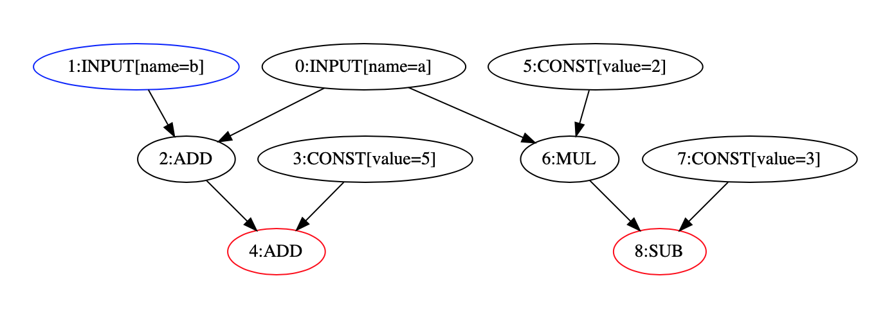

circkit
==========================================

:mod:`circkit` is a small framework for defining, constructing and manipulating
computational circuits. It aims to be very generic. :mod:`circkit` supports both
low-level circuits such as bit-based operations, word-based operations,
arithmetic circuits over a ring and high-level circuits made up by gates (nodes)
which are customized non-primitive functions.

:mod:`circkit` provides 3 types of built-in circuits, including arithmetic circuit,
boolean circuit and bitwise circuit. Additionally, it provides ISW transformer which
is able to transform a boolean circuit into a new boolean circuit whose nodes are the shares
as in the ISW scheme.

Specially, :mod:`circkit` allows users to define new circuit types
in which nodes can be their customized operations or functions. It also allows to define
a new transformer which provides the convenience of transforming a source circuit
to a target circuit. See the tutorials for more details.

Installation
------------
For arithmetic circuits working on finite fields, it needs to install Sagemath.
For circuits working on decimal numbers, integers, boolean and bitwise, it is not
necessary to install Sagemath.

Circuits with Sagemath
~~~~~~~~~~~~~~~~~~~~~~
1. Install `Sagemath <https://www.sagemath.org>`_.

2. Install :mod:`circkit` in Sagemath:

* via `PyPI`:

.. code-block:: none

    sage -pip install circkit

* or via `setup.py`:

.. code-block:: none

    sage -pip install .

3. Run your script with Sagemath:

.. code-block:: none

    sage -python script.py

Or you can open a notebook with Sagemath and build your circuit with the :mod:`circkit` framework:

.. code-block:: none

    sage -n

Circuits without Sagemath
~~~~~~~~~~~~~~~~~~~~~~~~~

1. Install :mod:`circkit`:

* via `PyPI`:

.. code-block:: none

    pip3 install circkit

* or via `setup.py`:

.. code-block:: none

    pip3 install .

2. Run your python script, for example:

.. code-block:: none

    python3 script.py

Using virtual environment
~~~~~~~~~~~~~~~~~~~~~~~~~
We can use a virtual enviroment to run *both circuits with and without Sagemath*.

1. Create a virtual environment of Sagemath:

.. code-block:: none

    sage -python -m venv --system-site-packages .venv

Then, go to the virtual enviroment:

.. code-block:: none

    source .venv/bin/activate

2. Install :mod:`circkit` in the virtual environment.

* via `PyPI`:

.. code-block:: none

    pip install circkit

* or via `setup.py`:

.. code-block:: none

    pip install .

3. Run your script on the virtual enviroment, for example:

.. code-block:: none

    python script.py

Or you can open a python notebook in this virtual enviroment and build your circuit.

Quick example
-------------

.. code:: ipython3

    from circkit.arithmetic import ArithmeticCircuit

    # Step 1: Initialize a new arithmetic circuit
    C = ArithmeticCircuit()

    # Step 2: Define the input nodes
    a = C.add_input("a")
    b = C.add_input("b")

    # Step 3: Perform the computation
    x = a + b + 5
    y = 2 * a - 3

    # Step 4: Define the output nodes
    C.add_output(x)
    C.add_output(y)
    # To see the graph of the circuit
    C.digraph().view()

    # Step 5: Evaluate the circuit
    # For example, a = 7, b = 9
    inp = [7, 9]
    out = C.evaluate(inp)
    print("Circuit output:")
    print(f"x = {out[0]}")
    print(f"y = {out[1]}")

.. code-block:: none

    Circuit output:
    x = 21
    y = 11

.. code:: ipython3

    # Verify
    a = 7
    b = 9
    x = a + b + 5
    y = 2 * a - 3
    print("Verification:")
    print(f"x = {x}")
    print(f"y = {y}")

.. code-block:: none

    Verification:
    x = 21
    y = 11

.. toctree::
   :maxdepth: 1
   :caption: Tutorials

   source/tuto-p1_builtin-circuit.rst
   source/tuto-p1_bitwise-circuit.rst
   source/tuto-p1_boolean-circuit.rst
   source/tuto-p2_new-circuit-type.rst
   source/tuto-p3_ISWtransformer.rst

.. toctree::
   :maxdepth: 1
   :caption: Advanced examples

   source/tuto-p4_bitsliceAES.rst
   source/tuto-p4_simon.rst
   source/tuto-p4_speck.rst
   source/tuto-p4_BUquadratic-masking.rst

.. .. toctree::
..    :maxdepth: 1
..    :caption: More docs

..    source/operation.rst
..    source/param.rst
..    source/circuit.rst
..    source/node.rst
..    source/const_manager.rst
..    source/arithmetic.rst
..    source/bitwise.rst
..    source/transformers.rst
..    source/location.rst

Framework vs DSL
----------------

There exist already several *domain specific languages* (DSL) for cryptographic primitives.
We decided to develop a python framework instead of a DSL to exploit the full power of a
mature programming language to create abstractions for designing and working with circuits.
Furthermore, the ability to overload arithmetic operations makes the framework as expressive as a DSL could be.

Authors
-------

Viet Sang Nguyen, Matthieu Rivain, Aleksei Udovenko and Junwei Wang.

Copyright 2022, CryptoExperts.

License
-------

:mod:`circkit` is available under the `MIT license <https://opensource.org/licenses/MIT>`_.

.. Indices and tables
.. ==================

.. * :ref:`genindex`
.. * :ref:`modindex`
.. * :ref:`search`
